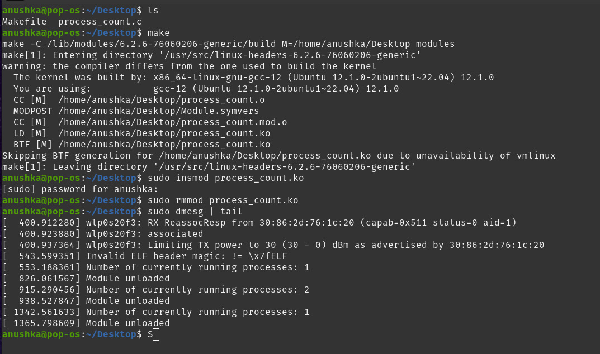

<html>
<h1>Module Programming</h1>
<h3>Introduction</h3>

This is a simple kernel module for the Linux kernel that counts the processes running currently and prints the count to the kernel log. The module is written in C and utilizes the Linux Kernel API to access process information.

<h3>Explanation</h3>

1. Includes necessary headers for kernel module development.

2. Define the module's metadata: 
    - MODULE_LICENSE("GPL"); 
    - MODULE_AUTHOR("Anushka-Vikranth"); 
    - MODULE_DESCRIPTION("Kernel");

3. The processes_init function is the module's initialization function. It iterates through the list of processes using the for_each_process macro and checks if each process is in the TASK_RUNNING state using task_struct, indicating it's currently running. It increments a count for each running process.

4. We print the count of currently running processes to the kernel log using printk.

5. The processes_exit function is the module's exit function, which is called when the module is unloaded. It prints a message indicating that the module has been unloaded.

<h3>Building the module</h3>
To build the module run the following steps: 

<ol><li><b>make</b>
 This will compile the source code and generate the kernel module file (process_count.ko). 
 
</li><li><b>sudo insmod process_count.ko</b></li>
To load the module into the kernel, use the insmod command
</li>
 
 
<li><b>sudo rmmod process_count.ko</b> 
To unload the module from the kernel, use the rmmod command
</li>
 
<li><b>sudo dmesg | tail</b> 
or  <b>sudo dmesg | grep "Number of currently running processes"</b> 
To view kernal logs to see how many processes are running
</li>
</ol>

Refer attached image:
 
 

<h3>License</h3>
This module is licensed under the GNU General Public License (GPL).
<h3>
Author</h3>
Anushka-Vikranth

</html>
